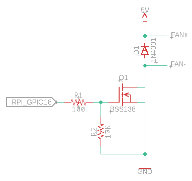

# rpi-fan-pwm
A python script to monitor CPU temperature and to adjust a fan speed accordingly.

To ensure that the python script is running continuously, the [supervisor](http://supervisord.org/) is used here (it monitors and restarts the script if needed).

# Connection

Resistor R2 is optional, though it's recommended to increase stability.

# Automatic installation (only debian based distros)
1. Clone this repository to some directory on the raspberry pi `git clone https://github.com/strange-v/rpi-fan-pwm`
1. Go to the cloned repo `cd ./rpi-fan-pwm`
1. Add execute permission for the installation script `chmod +x ./install.sh`
1. Execute the script `sudo ./install.sh`
